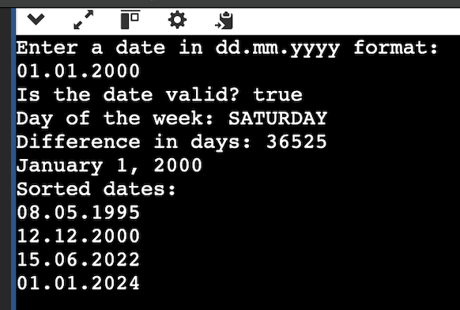

# Date-project

## Project Overview

This project is focused on handling `Date` objects in Java, with several functionalities such as:

- Sorting dates in ascending order using the `Comparable` interface.
- Calculating the difference in days between two `Date` objects.
- Validating the correctness of a given date, including leap year checks.
- Determining the day of the week for a given date.
- Printing the date in a formatted way.

The program works by implementing the `Comparable` interface for date comparison and utilizes `Collections.sort()` for sorting a list of dates. It also provides features for validating and manipulating dates, including the calculation of the difference in days between two dates.

## Compilation and Execution Instructions

### Requirements

- Java 8 or later is required to run the project.
  
### Steps to Compile and Run:

1. **Clone the Repository**:
   Clone the project repository to your local machine using the following command:
   ```bash
   git clone https://github.com/Axcol3/Date-project.git
2. **Navigate to the Project Directory: Change to the project directory:**
   cd Date-project
3. **Compile the Java Files: Compile the Main.java files using the Java compiler (javac):**
   javac Main.java
4. **Run the Program: Run the compiled program with the following command:**
   java Main

   The program will prompt you to enter a date in the format dd.mm.yyyy. It will validate the date, calculate the difference between two dates, and display the results.
   
**Example Output:**



## Additional Notes or Challenges

### Leap Year Handling
Special care was taken to ensure proper handling of leap years (years divisible by 4 but not 100, unless divisible by 400).

### Sorting
The program sorts dates using the `Comparable` interface by comparing year, month, and day.

### Edge Cases
The program correctly handles edge cases like invalid dates and leap years.

## Challenges
- Ensuring proper handling of leap years and month lengths (i.e., months with 31, 30, and 28 or 29 days).
- Correctly calculating the number of days between two dates, accounting for leap years and varying month lengths.
